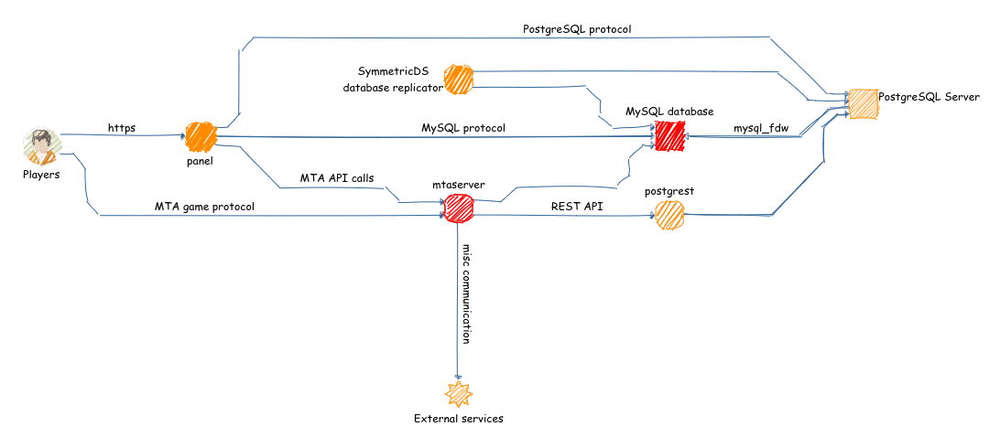

# Widok architektury

Kierunek strzałek oznacza kierunek nawiązywania połączeń, nie kierunek wymiany danych.

Na czerwono zaznaczone są komponenty absolutnie wymagane.

Usługi zewnętrzne to np. API ServerProject, API haveibeenpwned.com do bezpiecznej i poufnej weryfikacji czy hasła wprowadzane przez graczy nie są publicznie znane.

## Wykorzystanie bazy PostgreSQL

Baza MySQL mimo wielu swoich limitów bardzo dobrze spełnia swoje zadanie w roli źródła prawdy dla serwera gier.
MTA oferuje natywne i działające niezawodnie mechanizmy do interakcji z nią.
Niestety z powodu specyfiki działania serwera MTA, zapytania bazodanowe są wykonywane w wątku logicznym, w związku z czym ewentualne długo trwające zapytanie wprost zatrzymuje ten wątek.

Aby temu zapobiec wdrożona została dodatkowa baza PostgreSQL z interfejsem [postgrest](http://postgrest.org/). Dzięki temu można wykorzystać interfejs HTTP REST i realizować zapytania asynchronicznie, tj. możemy wrzucić do bazy danych zapytanie które będzie trwało nawet kilka sekund, serwer może kontynuować wątek logiczny i za jakiś czas obsłużyć callback kiedy dane bedą dostępne.

Co więcej, możliwe jest w ten sposób również sięgnięcie po dane zapisane w bazie MySQL:
- za pomocą [SymmetricDS](https://www.symmetricds.org/) możemy replikować dane na żywo z jednej bazy do drugiej, a także transformować je w dodatkowe sposoby lub odkładać do backupów
- korzystając modułów `mysql foreign data wrapper` możemy bezpośrednio z PostgreSQL odpytywać się o struktury w bazie MySQL, w tym je modyfikować.

Wykorzystanie jednego z powyższych, obu lub nawet żadnego zależne jest od konkretnych potrzeb projektowych.

Na uwadze należy mieć, że interfejs REST API Postgrest jest mniej elastyczny niż bezpośredni dostęp do bazy danych. Wykonywanie skomplikowanych zapytań, składających się np. z łączeń albo subselectów jest trudne lub niemożliwe. Należy to obchodzić za pomocą widoków (które w definicji zawierają podane łączenia) lub za pomocą procedur.

